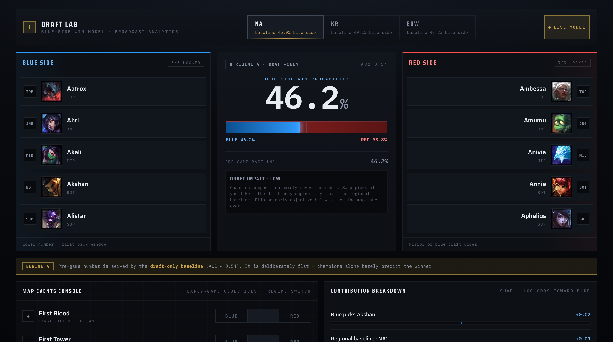

# DSC 148 — High-Elo League of Legends Win Prediction (Blue vs Red)

A binary classifier that predicts whether the **blue side wins** a high-elo League of Legends game, plus an interactive demo. **Headline finding:** the champion *draft* is near-uninformative in high elo (AUC ≈ 0.54); **early objectives** (first blood / tower / dragon / herald) recover a strong, region- and patch-invariant signal (AUC ≈ 0.79). What decides high-elo games is early-game map state, not who you pick.

**Author:** Yonghao Wang — DSC 148, University of California San Diego
**Code:** https://github.com/bothermeQAQ/lol-win-predictor · **Live demo:** https://lol-win-predictor-web.onrender.com · **Paper:** [`paper/DSC148_paper.pdf`](paper/DSC148_paper.pdf)

---

## Quick Start / How to Run

**🌐 Live demo:** **https://lol-win-predictor-web.onrender.com**
> ⏳ The **first** load can take **~30–60 s** while the backend cold-starts (free tier sleeps when idle) — that's expected, not a bug.

**▶️ Run the backend locally** (from the project root):
```bash
PORT=8008 PYTHONPATH=src python3 src/api/server.py
```

**▶️ Run the frontend locally** (in a second terminal):
```bash
cd frontend && npm install && npm run dev
```
`frontend/.env.local` already points at `http://localhost:8008`. Open the URL the dev server prints (default http://localhost:3000).

**📄 Paper / write-up:** [`paper/DSC148_paper.pdf`](paper/DSC148_paper.pdf).

---

## Overview
- **Problem.** Given the pre-game draft (champions, bans) and the earliest in-game objectives, predict the blue side's win probability — and quantify how much each information source actually contributes.
- **What the demo does.** Pick a region and five champions per side, optionally toggle who took each early objective, and get the blue win probability plus the top SHAP factors, live. Swapping champions barely moves the number (the negative result, made tangible); flipping *first tower* makes it jump.

## Dataset
- **Source:** Riot **Match-V5** API (real ranked matches), collected by `src/collect_data.py` — seeded from each region's apex ladder, parallelized across regional hosts, deduplicated by `matchId`.
- **Size:** **51,000** matches (**50,999** labeled after dropping one tie row). ≥ 50k instances.
- **Regions:** NA, KR, EUW — **17,000 each**.
- **Patches / dates:** 16.9–16.11 (mostly 16.10), 2026-04-29 → 2026-05-30.
- **Unit:** one ranked match. **Label:** does the blue side (team 1 / teamId 100) win?
- **Features:** champion picks + bans + summoner spells (the *draft*), region; plus 4 first-objective flags (first blood / tower / dragon / rift herald). Post-game state (kill counts, gold, duration, inhibitor, baron) is **excluded** to prevent label leakage (single source of truth: `src/data_utils.py`).
- **No PII:** the CSV contains no PUUIDs or summoner names.
- **EDA** (figures in `eda/`, discussed in paper §3): red side wins **54.2%** overall (KR closest to even at 49.1%); first tower gives the biggest win-rate swing (**+0.405**); champion picks diverge sharply by region (KR is distinct). These findings motivate the two feature regimes and the side/region encoding.

## Predictive Task
- **Input:** region + 5 blue champions + 5 red champions + (optional) 4 early-objective flags.
- **Output:** P(blue wins) → predicted winner.
- **Metrics:** Accuracy, blue-class F1, **ROC-AUC** (primary, because the classes are imbalanced — majority floor = **54.2%** red).
- **Two feature regimes:** **A** = draft-only; **B** = draft + early objectives. The A → B contrast is the main experiment.

## Models
- **Baselines:** Majority class, **Logistic Regression**, **Bernoulli Naive Bayes** (champions as an order-invariant bag — natural null models for "draft as a bag of champions").
- **Proposed:** **LightGBM** (gradient boosting, +region) and **ChampPoolNet** (32-d champion embeddings, mean-pooled per team), with a one-hot MLP as the control arm for the embedding-vs-one-hot ablation.
- **Feature design:** *team-symmetric multi-hot* (order-invariant within a team; separate blue/red column blocks to keep a side prior; no lane/slot encoding); region and patch as one-hot. Explainability via **SHAP**.
- **Optimization:** stratified 80/20 split (seed 42), early stopping on a held-out val split, light hyperparameter sweep (learning rate 0.03, 31 leaves). Libraries: lightgbm, scikit-learn, torch, shap, fastapi, Next.js.
- See paper §5 for unsuccessful tries (learned embeddings and nonlinearity buy nothing once features are matched; an out-of-distribution "all-objectives-none" issue fixed with a two-model demo) and engineering troubles (LightGBM/PyTorch OpenMP deadlock, sparse vectorization, pandas 3.0 NaN handling).

## Results (summary)
| Regime | Best model | Accuracy | ROC-AUC |
|---|---|---:|---:|
| Majority floor | — | 0.542 | 0.500 |
| **A — draft only** | LightGBM (+region) | 0.550 | **0.550** |
| **B — draft + early objectives** | LightGBM (+region) | 0.724 | **0.791** |

**Takeaway.** The draft alone is ≈ chance: feature-matched, the nonlinear model does **not** beat logistic regression (ΔAUC = −0.002, *p* = 0.67), and learned embeddings don't beat one-hot. Early objectives lift AUC to **≈ 0.79**, and that signal is stable across regions (3×3 transfer gap **0.003**) and patches (*p* = 0.89 for a patch feature); first tower dominates the SHAP attributions. Full comparison / significance / transfer tables, ablations, three case studies, and parameter-sensitivity sweeps are in the paper §6 (exact numbers emitted to `models/ckpt4_summary.txt`).

## Demo
**Live:** https://lol-win-predictor-web.onrender.com (first load ~30–60 s while the free-tier backend wakes).

**What it does:** select a region + 5 champions per side, toggle early objectives, and see P(blue win) + the top SHAP factors update live. With no objective set, the number barely moves as you swap champions — the negative result, made tangible. Set **first tower → blue** and it jumps from ~46% to ~77%.

**Example input.** Region **NA** · Blue: Aatrox, Ahri, Akali, Akshan, Alistar · Red: Ambessa, Amumu, Anivia, Annie, Aphelios · Objectives: **First Tower → Blue** → **output ≈ 76.5% blue win, model B** (vs ≈46.2% with no objectives).

**Local run.** Backend `PORT=8008 PYTHONPATH=src python3 src/api/server.py`; frontend `cd frontend && npm install && npm run dev` (`.env.local` → :8008). A Streamlit version also exists: `python3 -m streamlit run src/demo_app.py`.



## Reproducing the results
```bash
pip install -r requirements.txt                 # Homebrew Python: add --user --break-system-packages
PYTHONPATH=src python3 src/baselines.py          # baselines (LogReg / Naive Bayes)
PYTHONPATH=src python3 src/proposed.py           # LightGBM + ChampPoolNet
PYTHONPATH=src python3 src/ablations.py          # ablations / significance / transfer / patch / hyperparams / cases
PYTHONPATH=src python3 src/train_demo_model.py   # train + persist the served demo models -> models/demo/
PYTHONPATH=src python3 src/api/verify_api.py     # proves the served API == demo_core (|diff| = 0.00)
```
Results are written to `models/` (`ckpt4_summary.txt` holds the paper's exact numbers). Trained demo models are committed under `models/demo/`, so the API and demo run **without** retraining. (Collecting fresh data needs a Riot key: `export RIOT_API_KEY='RGAPI-...'` then `python3 src/collect_data.py`.)

## Repository structure
```
lol-win-predictor/
├── README.md  requirements.txt  requirements-api.txt  render.yaml  DEPLOY.md
├── src/
│   ├── collect_data.py            # Riot Match-V5 collector (key from $RIOT_API_KEY)
│   ├── data_utils.py  features.py # loading + leakage discipline + feature encoders
│   ├── baselines.py  proposed.py  ablations.py   # ckpt 2–4: models, ablations, significance
│   ├── train_demo_model.py  demo_core.py  demo_app.py  demo_selftest.py
│   └── api/server.py  api/verify_api.py           # FastAPI backend (served model)
├── frontend/                      # Next.js demo UI (calls the backend)
├── models/                        # ckpt outputs + demo/ (trained models + SHAP explainers, committed)
├── data/                          # raw_matches.csv (gitignored; PII-free)
├── eda/                           # EDA figures
└── paper/DSC148_paper.pdf         # the write-up (+ build_paper.py, figures)
```

## Notes
- **API key.** The Riot key is read from `$RIOT_API_KEY` at runtime — never hardcoded or committed.
- `data/` and `checkpoints/` are gitignored (raw data + collector state); `models/demo/` **is** committed so the demo/API run out of the box.
